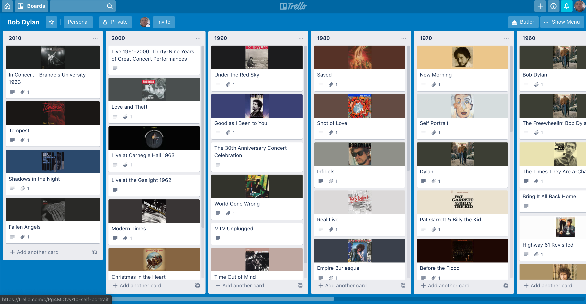

### Usage

To install project dependencies and run the exercise using example `discography.txt` data use:

```sh
npm install
npm start
```

### Configuration

Create `config.json` file with trello and spotify authentication information. Use `configTemplate.json` as a template:

```json
{
  "trello": {
    "key": "FILL_ME",
    "token": "FILL_ME"
  },
  "spotify": {
    "id": "FILL_ME",
    "secret": "FILL_ME"
  }
}
```

### Result

After execution a trello board like the following should be created: 

